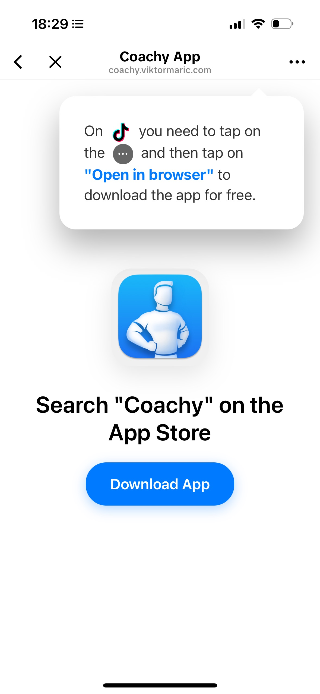

# TikTok App Landing Page

A simple, effective landing page designed specifically for TikTok bio links to promote mobile apps.



## Features

- Clean, mobile-friendly design with centered app icon and title
- Informative popup showing users how to download from TikTok
- Automatic redirect to App Store after 1 second
- Manual download button for immediate access
- Responsive layout that works on all devices

## Perfect for TikTok Bio Links

This landing page is ideal for app developers who want to:
- Convert TikTok traffic into app downloads
- Provide clear instructions for users coming from TikTok
- Create a professional first impression
- Maximize download conversion rates

## Customization

To adapt this landing page for your app:

1. **Replace the App Store URL**: Update the URL in both the download button and auto-redirect script
   ```html
   href="https://apps.apple.com/us/app/your-app/id1234567890"
   ```

2. **Replace the App Icon**: Replace `appicon.png` with your app's icon (120x120px recommended)

3. **Update the App Name**: Change "Coachy" to your app name in the title

## Usage

1. Clone this repository
2. Customize the URLs and images for your app
3. Deploy to your preferred hosting service
4. Add the URL to your TikTok bio

## Files

- `index.html` - Main landing page
- `appicon.png` - App icon image
- `tiktokicon.webp` - TikTok icon for the popup
- `.gitignore` - Git ignore file

Perfect for indie app developers, agencies, and anyone looking to maximize their TikTok to App Store conversion rates!